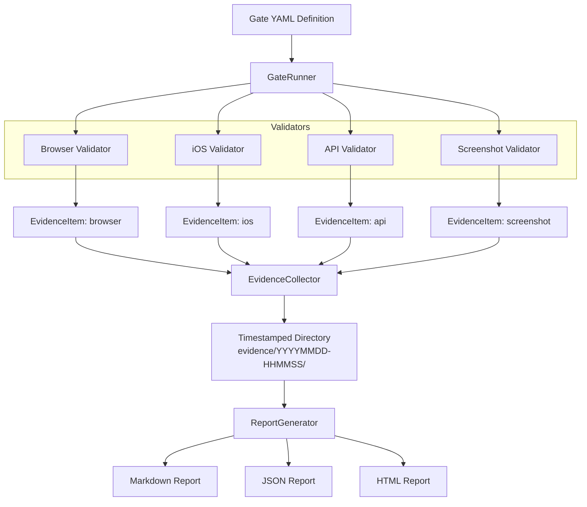

## I Banned Unit Tests From My AI Workflow

*Agentic Development: 10 Lessons from 8,481 AI Coding Sessions*

I said it out loud in a team meeting and watched the room go quiet: "I don't write unit tests anymore. I banned them."

Before you close this tab, hear me out. I didn't stop verifying my code. I stopped pretending that AI-generated tests verify anything.

Over 8,481 coding sessions with Claude Code, I discovered a fundamental problem with the test-driven workflow everyone assumes is best practice. When AI writes both the implementation AND the tests, passing tests are not independent evidence of correctness. They are a mirror reflecting itself.

So I built something different. I built a functional validation framework that forces real systems to prove they work -- with screenshots, accessibility trees, HTTP responses, and timestamped evidence you can audit after the fact.

This post walks through the framework, the code, and the four categories of bugs that unit tests systematically miss.

---

### The Mirror Problem

Here is the scenario that broke my faith in AI-generated tests.

I asked Claude to build a sidebar navigation component for an iOS app. It wrote the SwiftUI view. Then I asked it to write tests. It produced 14 unit tests. All green. Ship it.

Except the sidebar was invisible. The view existed in the hierarchy, the state management was correct, the navigation routing worked -- but a z-ordering issue meant the sidebar rendered behind the main content. Every unit test passed because they tested the model layer, not what the user sees.

This is not a contrived example. It happened. I have the screenshots to prove it.

The problem is structural. Unit tests verify implementation contracts. When the same intelligence writes both the contract and the verification, you get circular reasoning. The test suite becomes a tautology: "the code does what the code does."

Functional validation asks a different question: "Does the running system behave the way a human expects?"

---

### The Four Bug Categories Unit Tests Miss

After cataloging bugs across hundreds of sessions, I found they cluster into four categories that unit tests are structurally blind to.

#### 1. Visual Rendering Bugs

The sidebar z-ordering bug above. Colors that don't match the spec. Font sizes below the Human Interface Guidelines minimum (I found 39 instances of sub-11pt fonts in one audit pass). Layout that looks correct in a test harness but breaks on a real device frame.

These bugs exist in the gap between "the view model has the right state" and "the user sees the right thing." Unit tests live on one side of that gap. Users live on the other.

#### 2. Integration Boundary Bugs

A Vapor backend returns camelCase JSON. The iOS client expects snake_case. Every unit test on both sides passes independently. The system is broken.

I hit this exact bug with two backend binaries. The old backend at one path returned raw Claude Code data with bare arrays and snake_case. The current backend at another path returned proper API response wrappers with camelCase. Unit tests for both were green. The app was non-functional until I validated the actual HTTP response against the actual JSON decoder.

#### 3. State Management Bugs

SwiftUI re-renders on state changes. But a `@State` property initialized in the wrong lifecycle phase, or an `@EnvironmentObject` accessed before injection completes, produces crashes that no unit test catches -- because unit tests don't have a real SwiftUI lifecycle.

I discovered that changing the default `activeScreen` to `.settings` in a NavigationStack crashed the app because `@EnvironmentObject` wasn't ready during `@State` init. No test would have found this. The simulator found it in 2 seconds.

#### 4. Platform-Specific Bugs

Claude CLI includes nesting detection. If `CLAUDECODE=1` is in the environment, the CLI silently refuses to execute. When your Vapor backend runs inside a Claude Code session, spawned subprocesses inherit these variables. No error. No stderr. Just a zero-byte response.

The fix was three lines of code. Finding those three lines cost a full debugging session. No unit test would have surfaced this because the test environment wouldn't have the offending env vars.

---


---

### The Framework: Functional Validation From Scratch

I formalized all of this into a Python framework. The core idea: define validation gates, run them against live systems, collect timestamped evidence, and generate auditable reports.

The data model starts with Pydantic. Here are the core types:

```python
# src/fvf/models.py

class EvidenceType(str, Enum):
    SCREENSHOT = "screenshot"
    CURL_OUTPUT = "curl_output"
    ACCESSIBILITY_TREE = "accessibility_tree"
    LOG = "log"
    VIDEO = "video"
    NETWORK_HAR = "network_har"

class ValidationResult(BaseModel):
    status: ValidationStatus
    message: str
    evidence: list[EvidenceItem] = Field(default_factory=list)
    duration_ms: float = 0.0
    validator_name: str = ""

    @property
    def passed(self) -> bool:
        return self.status == ValidationStatus.PASSED

    @property
    def failed(self) -> bool:
        return self.status in (ValidationStatus.FAILED, ValidationStatus.ERROR)
```

Every validation produces a `ValidationResult` with an explicit status, a human-readable message, and a list of evidence items. Evidence is not optional. If you claim something passed, you need the receipts.

Gates are numbered, ordered, and can declare dependencies:

```python
# src/fvf/models.py

class GateDefinition(BaseModel):
    number: int = Field(ge=1, description="Gate number (1-based, determines execution order)")
    name: str
    description: str = ""
    criteria: list[GateCriteria] = Field(default_factory=list)
    depends_on: list[int] = Field(
        default_factory=list,
        description="Gate numbers that must pass before this gate runs",
    )

    @field_validator("depends_on")
    @classmethod
    def no_self_dependency(cls, v: list[int], info: Any) -> list[int]:
        number = info.data.get("number")
        if number is not None and number in v:
            raise ValueError(f"Gate {number} cannot depend on itself")
        return v
```

The dependency system matters. If Gate 1 ("App Launches") fails, there is no point running Gate 5 ("Chat Messages Render Correctly"). The `GateRunner` handles this automatically:

```python
# src/fvf/gates/gate.py

def run_all(self) -> list[GateResult]:
    completed: list[GateResult] = []
    failed_gate_numbers: set[int] = set()

    for gate in self._gates:
        if not self._check_dependencies(gate, completed, failed_gate_numbers):
            skipped = GateResult(
                gate=gate,
                status=ValidationStatus.SKIPPED,
                results=[
                    ValidationResult(
                        status=ValidationStatus.SKIPPED,
                        message=(
                            f"Skipped -- dependency gate(s) "
                            f"{gate.depends_on} did not pass"
                        ),
                        validator_name="GateRunner",
                    )
                ],
            )
            completed.append(skipped)
            failed_gate_numbers.add(gate.number)
            continue

        gate_result = self.run_gate(gate)
        completed.append(gate_result)
        if not gate_result.passed:
            failed_gate_numbers.add(gate.number)

    return completed
```

---

### Four Validators for Four Surfaces

The framework ships with four validators. Each targets a different validation surface.

#### The Browser Validator

Uses Playwright to drive a real Chromium browser. No JSDOM. No enzyme. A real browser rendering real pixels:

```python
# src/fvf/validators/browser.py

class BrowserValidator(Validator):
    def validate(self, criteria: GateCriteria) -> ValidationResult:
        # ...
        with sync_playwright() as pw:
            browser = pw.chromium.launch(headless=True)
            context = browser.new_context()
            page = context.new_page()
            page.set_default_timeout(self._config.browser_timeout)

            response = page.goto(url, wait_until="networkidle")

            for action in vc.get("actions", []):
                self._execute_action(page, action)

            for assertion in vc.get("assertions", []):
                atype = assertion.get("type", "")
                if atype == "status_code":
                    expected_code = int(assertion.get("expected", 200))
                    actual_code = response.status if response else -1
                    ok = self._check_status_code(actual_code, expected_code)
                    # ...
                elif atype == "element_visible":
                    selector = assertion.get("selector", "")
                    ok = self._check_element_visible(page, selector)
                    # ...

            # Always capture a screenshot as evidence
            page.screenshot(path=str(screenshot_path), full_page=True)
```

That last line is the key. Every single validation run captures a screenshot. Even if all assertions pass. The screenshot is evidence you can review tomorrow when someone asks "are you sure this worked?"

#### The iOS Validator

Drives the actual iOS Simulator via `idb` and `simctl`. Deep links, tap gestures, swipe gestures, accessibility tree inspection:

```python
# src/fvf/validators/ios.py

class IOSValidator(Validator):
    def validate(self, criteria: GateCriteria) -> ValidationResult:
        # ...
        if dl := vc.get("deep_link"):
            self._deep_link(dl)
            time.sleep(1.5)  # Allow app to settle

        for action in vc.get("actions", []):
            self._execute_action(action)

        tree = self._get_accessibility_tree()

        for assertion in vc.get("assertions", []):
            atype = assertion.get("type", "")
            if atype == "element_present":
                label = assertion.get("label", "")
                element = self._find_element(tree, label)
                ok = element is not None
```

The accessibility tree search is recursive. It walks the entire UI hierarchy looking for elements by label, checking both the `label` and `value` attributes:

```python
# src/fvf/validators/ios.py

def _find_element(self, tree: dict[str, Any], label: str) -> dict[str, Any] | None:
    if not tree:
        return None

    node_label = str(tree.get("label", "") or tree.get("AXLabel", ""))
    node_value = str(tree.get("value", "") or tree.get("AXValue", ""))
    if label.lower() in node_label.lower() or label.lower() in node_value.lower():
        return tree

    for child in tree.get("children", []):
        found = self._find_element(child, label)
        if found is not None:
            return found

    return None
```

This is how you verify an iOS app works: you open it, you navigate to a screen, you dump the accessibility tree, and you check that the elements you expect are actually present. Not "the view model contains the right data." The elements. On screen. In the tree.

#### The API Validator

Makes real HTTP requests with `httpx`. Status codes, response times, JSON path assertions, schema validation:

```python
# src/fvf/validators/api.py

class APIValidator(Validator):
    def validate(self, criteria: GateCriteria) -> ValidationResult:
        # ...
        with httpx.Client(timeout=timeout_s) as client:
            response = client.request(
                method, url,
                headers=headers,
                json=body if isinstance(body, (dict, list)) else None,
            )
        duration_ms_actual = (time.monotonic() - request_start) * 1000

        ok = self._check_status(response.status_code, expected_status)
        ok = self._check_response_time(duration_ms_actual, max_response_time_ms)
```

Every API validation saves a curl-equivalent command as evidence. You can replay it. You can share it. You can paste it into a terminal six months later and see if the endpoint still works.

#### The Screenshot Validator

Captures and optionally compares screenshots against reference images using pixel-level similarity scoring:

```python
# src/fvf/validators/screenshot.py

def _compare_screenshots(self, actual: Path, reference: Path, threshold: float) -> tuple[bool, float]:
    img_actual = Image.open(actual).convert("RGB")
    img_reference = Image.open(reference).convert("RGB")

    if img_actual.size != img_reference.size:
        img_reference = img_reference.resize(img_actual.size, Image.LANCZOS)

    diff = ImageChops.difference(img_actual, img_reference)
    pixels = list(diff.getdata())
    total_diff = sum(max(r, g, b) for r, g, b in pixels)
    max_possible = len(pixels) * 255
    similarity = 1.0 - (total_diff / max_possible)
    return similarity >= threshold, similarity
```

This catches the class of visual regression that no amount of unit testing will find. A CSS change that shifts a button 3 pixels. A theme change that makes text unreadable against its background. A z-index change that hides a critical element.

---

### The Evidence System

Evidence is not an afterthought. It is the core of the framework. The `EvidenceCollector` organizes artifacts into a timestamped directory structure:

```python
# src/fvf/gates/evidence.py

class EvidenceCollector:
    """
    Directory structure:

        evidence/
          gate-1/
            20240101-120000/
              manifest.json
              screenshot-browser-1234.png
              api-curl-1234.txt
          gate-2/
            20240101-120010/
              manifest.json
    """

    def collect(self, gate_number: int, items: list[EvidenceItem]) -> Path:
        timestamp = datetime.utcnow().strftime(self._TIMESTAMP_FORMAT)
        attempt_dir = self._gate_dir(gate_number) / timestamp
        attempt_dir.mkdir(parents=True, exist_ok=True)

        saved: list[EvidenceItem] = []
        for item in items:
            saved_item = self._save_item(item, attempt_dir)
            saved.append(saved_item)

        self._generate_manifest(saved, attempt_dir)
        return attempt_dir
```

Multiple attempts are preserved independently. Each attempt gets its own timestamped directory and a `manifest.json` describing every artifact. You can diff evidence across attempts. You can see exactly when a regression was introduced.

The report generator produces Markdown, JSON, or self-contained HTML with embedded base64 screenshots:

```python
# src/fvf/gates/report.py

class ReportGenerator:
    def to_html(self, report: GateReport) -> str:
        # Screenshots embedded as base64 data URIs
        for item in gr.total_evidence:
            if item.type.value == "screenshot" and item.path.exists():
                b64 = base64.b64encode(item.path.read_bytes()).decode()
                # Embed directly in 
```

The HTML report is fully portable. No external dependencies. Drop it in a PR comment, email it, put it in a wiki. The evidence travels with the claim.



---

### The CLI: Three Commands

The whole framework runs from the command line:

```bash
# Scaffold a gate config
fvf init --type browser

# Run all gates
fvf validate --gate gates.yaml

# Generate a report
fvf report --evidence-dir ./evidence/ --format html

# Run a single gate
fvf gate run 3 --gate-file gates.yaml

# List gates with evidence status
fvf gate list gates.yaml --evidence-dir ./evidence/
```

The `validate` command is the workhorse. It loads gate definitions from YAML, instantiates the appropriate validators, runs them in dependency order, collects evidence, prints a rich progress bar, and exits with code 0 if all gates pass, 1 if any fail. CI-friendly out of the box.

---

### The Numbers

Across the ILS project (the native iOS client for Claude Code that this series covers), functional validation produced:

- 470+ screenshots as validation evidence
- 37+ validation gates across 10 development phases
- 3 browser automation tools integrated (Playwright, idb, simctl)
- 4 bug categories systematically caught that unit tests miss
- 0 unit tests written. Zero. Not one.

The 470 screenshots are not decorative. Each one is timestamped evidence that a specific screen, in a specific state, on a specific device, rendered correctly at a specific point in time. When a regression appears three weeks later, I can binary-search through evidence directories to find exactly when it broke.

---

### The Aggregated Report

At the end of a validation run, the `GateReport` model computes derived metrics:

```python
# src/fvf/models.py

class GateReport(BaseModel):
    project_name: str
    gates: list[GateResult] = Field(default_factory=list)
    total_gates: int = 0
    passed: int = 0
    failed: int = 0
    evidence_count: int = 0

    def model_post_init(self, __context: Any) -> None:
        if self.gates and self.total_gates == 0:
            self.total_gates = len(self.gates)
            self.passed = sum(1 for g in self.gates if g.passed)
            self.failed = self.total_gates - self.passed
            self.evidence_count = sum(len(g.total_evidence) for g in self.gates)

    @property
    def pass_rate(self) -> float:
        if self.total_gates == 0:
            return 0.0
        return self.passed / self.total_gates
```

This is the final artifact. Not "47 tests pass." Instead: "13/13 gates passed, 42 evidence items collected, 100% pass rate." And behind that number is a directory tree of screenshots, accessibility dumps, and curl outputs that anyone can audit.

---

### What This Actually Looks Like in Practice

A typical gate YAML for the iOS app looks like this:

```yaml
project: ils-ios
gates:
  - number: 1
    name: App Launches
    description: Verify the app launches and shows the home screen
    criteria:
      - description: Home screen visible
        evidence_required: [screenshot, accessibility_tree]
        validator_type: ios
        validator_config:
          deep_link: ils://home
          assertions:
            - type: element_present
              label: Home

  - number: 2
    name: Sessions Load
    depends_on: [1]
    criteria:
      - description: Sessions screen shows data
        evidence_required: [screenshot, accessibility_tree]
        validator_type: ios
        validator_config:
          deep_link: ils://sessions
          assertions:
            - type: element_present
              label: Sessions
```

Gate 2 depends on Gate 1. If the app doesn't launch, we don't bother checking if sessions load. This is obvious logic, but it's logic that unit test frameworks don't give you out of the box.

---

### The Lesson

I am not saying unit tests are useless in general. I am saying that when AI writes both the code and the tests, the tests lose their epistemic value. They become a ritual, not a verification.

Functional validation restores the independence. The validator doesn't know how the code works. It knows what the user should see. It opens the app, navigates to a screen, and checks if the right elements are there. If they are, it takes a screenshot as proof. If they aren't, it tells you exactly what's missing.

After 8,481 sessions, this is the most counterintuitive lesson I've learned: the way to ship faster with AI is to stop writing tests and start collecting evidence.

The companion repo has the full framework. Clone it, run `fvf init`, and try it on your own project. I think you'll be surprised how many bugs your test suite has been hiding.

[functional-validation-framework on GitHub](https://github.com/nickbaumann98/functional-validation-framework)

---

*Part 3 of 11 in the [Agentic Development](https://github.com/krzemienski/agentic-development-guide) series.*
